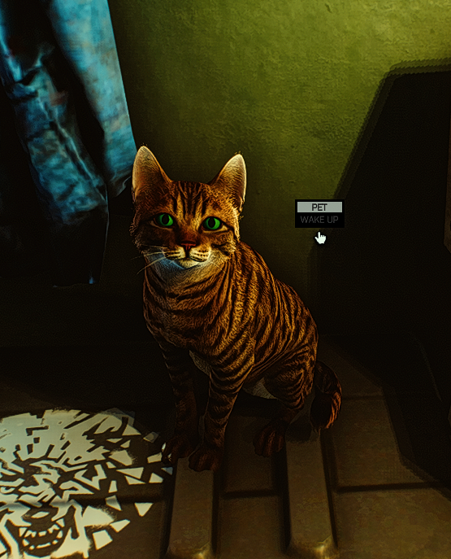

# HideoutCat — SPT 4.0.13 Port



**Original mod:** [bmpq/spt-hideoutcat](https://github.com/bmpq/spt-hideoutcat) by bmpq (v1.0.1, SPT 3.11)
**4.1.x version:** [bushtail/spt-hideoutcat](https://github.com/bushtail/spt-hideoutcat) by bushtail (v1.1.0 → v1.1.1, SPT 4.1.x)
**Port & fixes:** DarkEsteves
**Target:** SPT 4.0.13 (EFT 0.16.9)
**License:** MIT (same as original)

---

## Description

Full port of the Hideout Cat mod to SPT 4.0.13, with a batch of fixes and a fully
configurable in-game settings menu (F12). The cat lives in your hideout: wanders
between areas, sits, lies down, sleeps, eats, grooms, meows at you and can be petted.

### Requirements to spawn

- **Nutrition Unit** level 1+ **AND** Heating level 1+

### What was fixed / changed for 4.0.13

| # | Fix |
|---|-----|
| 1 | **API migration** — rebuilt from the 4.1.x version to work with the older 4.0.13 game code (some methods changed between versions) |
| 2 | **Area levels** — fixed how the cat reads hideout area levels (changed from a simple number to a dictionary lookup) |
| 3 | **Spawn placement** — cat now spawns at a valid waypoint in an unlocked area, not stuck at the world origin |
| 4 | **Cat always "busy"** — fixed a bug where the cat never wandered or meowed because it thought it was always busy |
| 5 | **Stuck in place** — cat now properly clears its destination when it arrives, so it can pick a new area to wander to |
| 6 | **Footstep audio** — fixed footstep sounds dragging/looping (added one-shot playback) |
| 7 | **Footstep timer** — fixed footsteps firing every frame instead of at proper intervals |
| 8 | **Meows cut out** — meows now play on their own audio source, so they don't get cut off by player movement sounds |
| 9 | **Meow/mouth sync** — meow audio is now delayed slightly to match the cat's mouth opening animation |
| 10 | **Cat clips through furniture** — added ground-snap and landing checks so the cat walks on real surfaces and doesn't fall through objects |
| 11 | **Flashlight eye reaction** — removed (the 4.0.13 game code no longer supports this feature) |

### F12 Configuration menu (live)

- **Cat** — Coat (Grey/Black/Orange/White/Brown/Bicolor), Eye Colour — *applies instantly*
- **Audio** — Meow Volume, Step Volume, Footsteps Enabled
- **Behavior** — Meow Frequency, Proximity Meow Distance
- **Movement** — Walk Speed Multiplier, Wander Frequency
- **Spawning** — Enable Cat (instant remove/spawn toggle)


---

## Installation

1. Download the latest release (or build below)
2. **Extract the `HideoutCat` folder into your SPT root folder** (where `SPT.Server.exe` is located)
3. Launch SPT
4. In-game: hideout requires Nutrition Unit 1+ and Heating 1+

---

## Build

```
dotnet build -c Release
```

References resolve against `J:\Jogos\SPT-4.0.13` by default (change `TarkovDir` in the csproj).

---

## Credits / Créditos

- **bmpq** — original mod and asset bundles
- **bushtail** — SPT 4.1.x version (base for this port)
