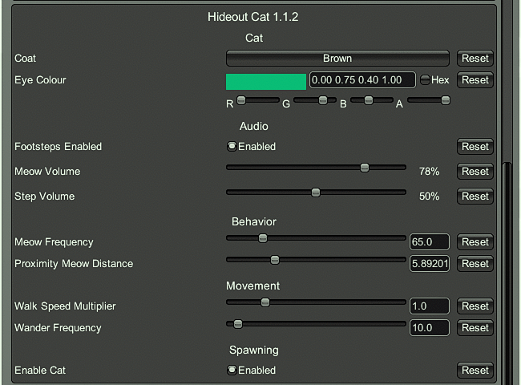

# Hideout Cat — SPT 4.0.13 Port (v1.1.2-SPT.4.0.13)

**Original mod:** [bmpq/spt-hideoutcat](https://github.com/bmpq/spt-hideoutcat) by bmpq (v1.0.1, SPT 3.11)
**4.1.x version:** [bushtail/spt-hideoutcat](https://github.com/bushtail/spt-hideoutcat) by bushtail (v1.1.0 → v1.1.1, SPT 4.1.x)
**Port & fixes:** DarkEsteves
**Target:** SPT 4.0.13 (EFT 0.16.9)
**License:** MIT (same as original)



---


Full port of the Hideout Cat mod to SPT 4.0.13, with a batch of fixes and a fully
configurable in-game settings menu (F12). The cat lives in your hideout: wanders
between areas, sits, lies down, sleeps, eats, grooms, meows at you and can be petted.

### Requirements to spawn

- **Nutrition Unit** level 1+ **AND** Heating level 1+

### What was fixed / changed for 4.0.13

| # | Fix |
|---|-----|
| 1 | **API migration** — rebuilt on the 3.11-style API that still exists in 4.0.13: `HideoutController` instance capture (not a Singleton), `GetActionsClass.GetAvailableHideoutActions(HideoutPlayerOwner, GInterface177)`, `ActionsReturnClass`/`ActionsTypesClass`, `AreaScreenSubstrate.SelectArea`, `BonusPanel.UpdateView` |
| 2 | **Area levels** — `HideoutController.Areas` is a `Dictionary<EAreaType, HideoutArea>`; level is resolved via `Array.IndexOf(AreaLevels, CurrentLevel)` (`Plugin.GetAreaLevel`) instead of the int `AreaData.CurrentLevel` from 4.1 |
| 3 | **Spawn placement** — cat now spawns at a dead-end waypoint of an unlocked area (original logic restored), not frozen at the prefab origin |
| 4 | **`IsBusy()` freeze bug** — upstream comparison counted Idle/Sitting/Lying as "busy", so the cat never wandered or meowed. Now only Sleeping/Eating/Defecating are busy |
| 5 | **Stuck-target bug** — `_currentTargetArea` is cleared on arrival so the cat can pick any area again; fallback to closest waypoint if no area nodes exist |
| 6 | **Audio smear** — `BetterSource.Play` on 4.0.13 requires explicit `oneShot: true`; without it footsteps stacked into a dragging noise |
| 7 | **Footstep timer** — `_stepTimer` is now reset when a step plays (was firing every frame) |
| 8 | **Meow cutting out** — meows/purrs play on the cat's own `AudioSource` (the shared Character pool gets stolen by player movement sounds) |
| 9 | **Meow/mouth sync** — audio delayed ~0.1 s to line up with the animator's mouth opening |
| 10 | **No-clip through furniture** — the node graph was authored for the 4.1 hideout layout. Added `GroundSnap()` (idle) and landing checks during jumps: raycasts keep the cat on real surfaces, land on top of obstacles instead of falling inside them, and push him out of walls |
| 11 | **Flashlight eye reaction disabled** — 4.0.13 has no accessible `CameraManager.Flashlight`; cosmetic-only loss |

### F12 Configuration menu (live)

- **Cat** — Coat (Grey/Black/Orange/White/Brown/Bicolor), Eye Colour — *applies instantly*
- **Audio** — Meow Volume, Step Volume, Footsteps Enabled
- **Behavior** — Meow Frequency, Proximity Meow Distance
- **Movement** — Walk Speed Multiplier, Wander Frequency
- **Spawning** — Enable Cat (instant remove/spawn toggle)

### Install

1. Download the latest release (or build below)
2. Extract `HideoutCat` into `SPT/BepInEx/plugins/`
3. In-game: hideout requires Nutrition Unit 1+ and Heating 1+

### Build

```
dotnet build -c Release
```

References resolve against `J:\Jogos\SPT-4.0.13` by default (change `TarkovDir` in the csproj).

---

---

🌐 [**Versão PT**](index.html) | [English Version](README.md)

## Credits / Créditos

- **bmpq** — original mod and asset bundles
- **bushtail** — SPT 4.1.x version (base for this port)
